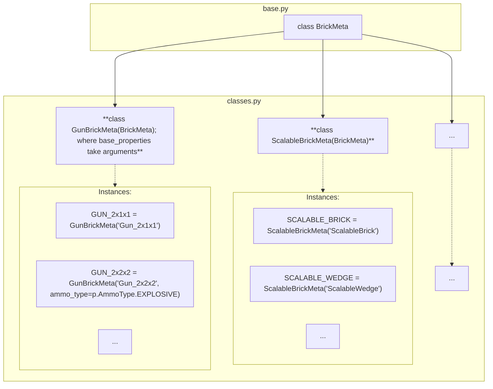

# `brickedit.bt`: Brick Types

## Having trouble understanding this?

Having trouble understanding this?

Are you a beginner in computer science or unfamiliar with Python? This short section will give some information to go back to if you need help reading:

- Decorators are things that wrap around functions and classes to easily add additional code. You can see them as a special kind of function. They are placed above a class or function and start with `@`. They can take arguments in parentheses. For example: `@staticmethod`, `@p.register(BRICK_MATERIAL)`.
- While somewhat uncommon in Python, there are generic types. A concise note: TypeVars and Generic are used by type checkers (mypy, IDEs) and are not enforced at runtime. `T` is a common name for a type variable. Example usage: `class MyClass(ParentClass[str])` tells type checkers that all `T`s in `ParentClass`'s are `str`.

This module contains all brick types and their classes in brickedit:
- `BrickMeta`: Class defining how brick types must be defined. Its subclasses are the different brick classes instanciated by individual bricks.
- Class of each brick type. For example, `GunBrick`, `ScalableBrick`,... .

## Structure as a graph

## Defining new brick types: `BrickMeta(ABC)`

`BrickMeta` is the base class for all brick types.

Each subclass of `BrickMeta` must define the following:
- `@abstractmethod base_properties(self, *args, **kwargs) -> dict[str, object]` which creates a new object holding the default properties for each individual brick type. Anything may be added to args and kwargs and be used to determine the outputted dictionary.