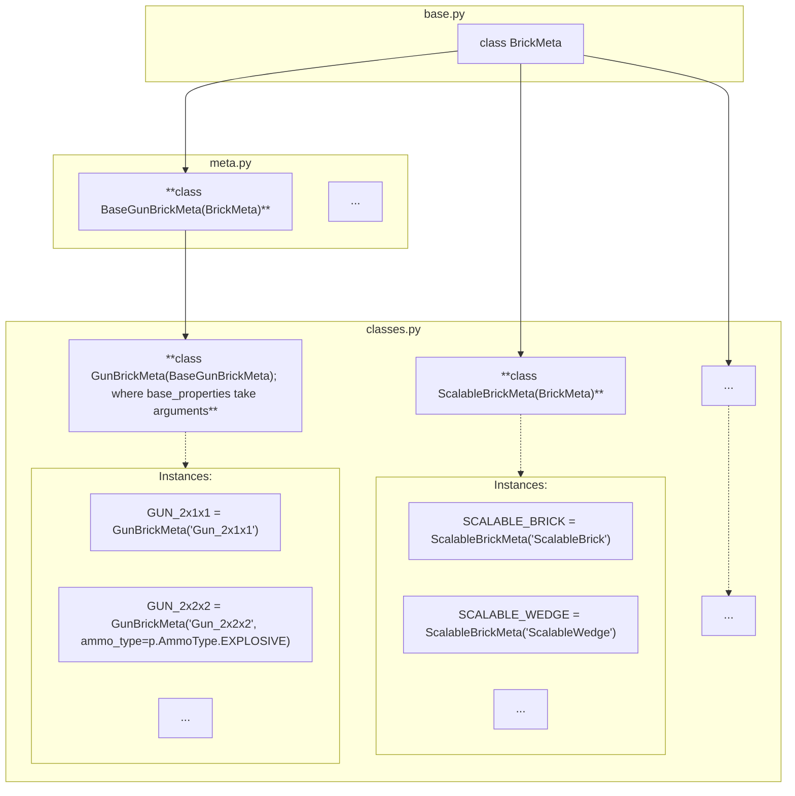

# `brickedit.bt`: Brick Types


## Having trouble understanding this?

<details>
<summary>Having trouble understanding this?</summary>

Are you a beginner in computer science or unfamiliar with Python? This short section will give some information to go back to if you need help reading:

- Decorators are things that wrap around functions and classes to easily add additional code. You can see them as a special kind of function. They are placed above a class or function and start with `@`. They can take arguments in parentheses. For example: `@staticmethod`, `@p.register(BRICK_MATERIAL)`.
- While somewhat uncommon in Python, there are generic types. TypeVars and Generic are used by type checkers (mypy, IDEs) and are not enforced at runtime. `T` is a common name for a type variable. Example usage: `class MyClass(ParentClass[str])` tells type checkers that all `T`s in `ParentClass`'s are `str`.

</details>


This module contains all brick types and their classes in brickedit:
- `BrickMeta`: Class defining how brick types must be defined. Its subclasses are the different brick classes instanciated by individual bricks.
- Class of each brick type. For example, `GunBrick`, `ScalableBrick`,... .


## Structure as a graph



## Defining new brick types: `BrickMeta(ABC)`

`BrickMeta` is the base class for all brick types.

Each subclass of `BrickMeta` must define the following:
- `@abstractmethod base_properties(self, *args, **kwargs) -> dict[str, object]` which creates a new object holding the default properties for each individual brick type. Anything may be added to args and kwargs and be used to determine the outputted dictionary.
- When applicable, provide additional data through `__init__`'s arguments and make them accessible in additional methods (eg. see `CarWheelBrickMeta`)

Your brick type must contain properties for all versions, therefore properties that do not belong to a version of the BRV may still be interacted with. To prevent this, when a property is serialized / deserialized and the dedicated methods return `p.InvalidVersion`; the property is discarded. See [p.md](p.md)


## Registration: `register`

BrickEdit **automatically** registers new **instances** of `BrickMeta`. Brick types are registered in `BrickMeta.__init__` using the function (not decorator) `register(name: str, obj: _Tbm, registry: dict[str, _Tbm] | None = None)`


- `name` (`str`): is the internal name of the brick type. For example, for `ScalableWedge`: `register('ScalableWedge')`;
- `obj` (child of `BrickMeta`): brick meta to register;
- `registry` (`dict[str, Type[PropertyMeta]] | None = None`): is the registry to add the entry to. By default this argument does not have to be specified and brick types will be registered to brickedit's register.

BrickEdit's default brick type registry is `bt_registry: dict[str, _Tbm]`.


## How `BrickMeta.base_properties` works

`BrickMeta.base_properties` is called once to set the attribute `p` of each `BrickMeta` class. This attribute is never edited, so you do not have to worry about mutability. Bricks allow you to change properties by storing the properties that are not set to default values in a dict (which also helps serialize and deserialize brv files faster).

Every brick shares a few common properties: color, pattern, and material. We recommend if you add several bricks you make a dict containing these properties.


## Example of a full implementation of a material

Using `MY_PROPERTY` previously created in the example of a full implementation of a property in [p.md](p.md#implementation-2-the-easy-way) (class `MyPropertyMeta2`):

```py
from brickedit import *
from collections.abc import Hashable
from typing import Final

# Set base_properties, to shorten code and make edits easier of we add more brick metas.
base_properties: dict[str, Hashable] = {
    p.BRICK_COLOR: p.BrickColor.DEFAULT_COLOR,
    p.BRICK_PATTERN: p.BrickPattern.NONE,
    p.BRICK_MATERIAL: p.BrickMaterial.PLASTIC
}


class MyBrickMeta(bt.BrickMeta):

    # We create the base properties.
    # Our made up property's default value depends on the brick,
    # so we pass as keyword argument the value of this brick for each brick type
    def base_properties(self, *args, **kwargs):

        # Get the keyword argument mp
        my_property_value = kwargs.get("mp")
        assert my_property_value is not None, "mp is not set for brick type " + self._name

        # When a brick has no unique properties, return base_properties.copy()
        return base_properties | {
            p.DISPLAY_COLOR: 0xff7f00ff
            MY_PROPERTY: my_property_value
        }

MY_CUSTOM_BRICK_1: Final = MyBrickMeta("MyCustomBrick1", mp=MyPropertyMeta2.FIRST_OPTION)
MY_CUSTOM_BRICK_2: Final = MyBrickMeta("MyCustomBrick2", mp=MyPropertyMeta2.SECOND_OPTION)
MY_CUSTOM_BRICK_3: Final = MyBrickMeta("MyCustomBrick3", mp=MyPropertyMeta2.THIRD_OPTION)
```
