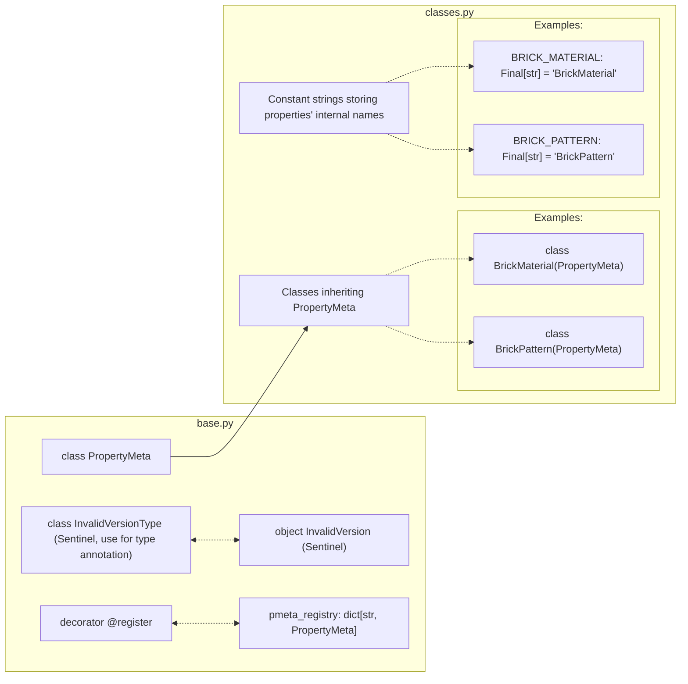

# `brickedit.p`: Properties

## Having trouble understanding this?

<details>
<summary>Having trouble understanding this?</summary>

Are you a beginner in computer science or unfamiliar with Python? This short section will give some information to go back to if you need help reading:

- Decorators are things that wrap around functions and classes to easily add additional code. You can see them as a special kind of function. They are placed above a class or function and start with `@`. They can take arguments in parentheses. For example: `@staticmethod`, `@p.register(BRICK_MATERIAL)`.
- While somewhat uncommon in Python, there are generic types. A concise note: TypeVars and Generic are used by type checkers (mypy, IDEs) and are not enforced at runtime. `T` is a common name for a type variable. Example usage: `class MyClass(ParentClass[str])` tells type checkers that all `T`s in `ParentClass`'s are `str`.

</details>

## Structure as a graph


-----

Note: as of the time of writing, BRMK does not let modders add their own property types. The methods to create your own properties are nonetheless documented here for future proofing, whether BRMK adds custom property support or brickedit becomes outdated.

This module contains everything to handle properties in brickedit:
- `PropertyMeta`: Class defining how to serialize and deserialize all properties. Its subclasses contains all its possible values throughout the versions.
- `pmeta_registry`: A dictionary binding all `PropertyMeta`s subclasses to properties' internal name as string.
- `@register`: Registers `PropertyMeta`s subclasses to `pmeta_registry`. For example: `@register(BRICK_MATERIAL)`.
- Tens of subclasses of `PropertyMeta` each defining a property type and their internal name stored in similarly named screaming snake case variables. For example: `BRICK_MATERIAL: Final[str] = "BrickMaterial"` and `class BrickMaterialMeta(PropertyMeta)`.

## Defining properties: `PropertyMeta(Generic[T], ABC)`

`PropertyMeta` is the base class for all property types. It defines how a property is serialized and deserialized.

Each subclass of `PropertyMeta[T]` must define the following:
- `@staticmethod serialize(self, v: T, version: int) -> bytearray`: Serializes the property value `v` to a bytearray for the given version. Typically directly returns result of `serialization` classes methods.
- `@staticmethod deserialize(self, v: bytearray, version: int) -> T:`: Deserializes the property value from the given byte array `v` for the given version. Typically directly returns result of `serialization` classes methods.
- When applicable (mainly in the case of enums, e.g. for materials), class-level constant string variable defining the internal names of all possible options throughout the supported versions. For example: `PLASTIC: Final[str] = "Plastic"` for `BrickMaterialMeta`.

Your property may not exist in your current version. You may signal brickedit that it should be disregarded by returning `InvalidVersion` upon serialization. For type annotation, use the class name `InvalidVersionType`.

## Internal name variable (QoL)

BrickEdit defines and recommend you to define for each `PropertyMeta` subclass a variable (as a final screaming snake case) named after the property, and holding the internal name of the property.

For example: `BRICK_MATERIAL: Final[str] = "BrickMaterial"` for the `BrickMaterial` class.

## Registration: `@register`

BrickEdit will not know of a property unless you register it. To register a property, use the `@register(name: str, registry: dict[str, Type[PropertyMeta]] | None = None)`.

- `name` (`str`): is the internal name of the variable. For example, for `BrickMaterial`: `register(BRICK_MATERIAL)`

- `registry` (`dict[str, Type[PropertyMeta]] | None = None`): is the registry to add the entry to. By default this argument does not have to be specified and properties will be registered to brickedit's register.


## Example of a full implementation of a property

```python
from brickedit import *
from typing import Final

# Internal name variable
MY_PROPERTY: Final[str] = 'MyProperty'

# Registration decorator required for be to detect and use this data type
@p.register(MY_PROPERTY)
class MyPropertyMeta(p.PropertyMeta[str]):

    # Our made up property type is an enum with 3 possible states
    FIRST_OPTION: Final[str] = 'FirstOption'
    SECOND_OPTION: Final[str] = 'SecondOption'
    THIRD_OPTION: Final[str] = 'ThirdOption'

    # Our made up property type only existed since modern Brick Rigs (1.0)

    @staticmethod
    def serialize(v: str, version: int) -> bytearray | p.InvalidVersionType:
        # Checking if this property exist in our current version
        if (version < 7):
            return p.InvalidVersion
        # Enums are often stored as a utf-8 string prefixed by its length as a UInteger8
        return serialization.UInteger8.serialize(len(v)) + serialization.EnumValue.serialize(v)

    @staticmethod
    def deserialize(v: bytearray, version: int) -> str | p.InvalidVersionType:
        # Checking if this property exist in our current version
        if (version < 7):
            return p.InvalidVersion
        # Enums are often stored as a utf-8 string prefixed by its length as a UInteger8
        # Given brickedit already slices the bytearray to only contain the property value, we can skip the first byte
        return serialization.EnumValue.deserialize(v[1: ])
```