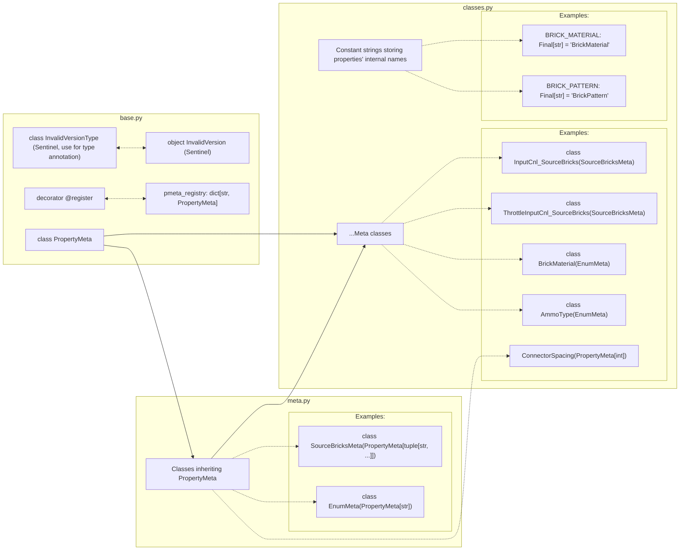

# `brickedit.p`: Properties

## Having trouble understanding this?

<details>
<summary>Having trouble understanding this?</summary>

Are you a beginner in computer science or unfamiliar with Python? This short section will give some information to go back to if you need help reading:

- Decorators are things that wrap around functions and classes to easily add additional code. You can see them as a special kind of function. They are placed above a class or function and start with `@`. They can take arguments in parentheses. For example: `@staticmethod`, `@p.register(BRICK_MATERIAL)`.
- While somewhat uncommon in Python, there are generic types. TypeVars and Generic are used by type checkers (mypy, IDEs) and are not enforced at runtime. `T` is a common name for a type variable. Example usage: `class MyClass(ParentClass[str])` tells type checkers that all `T`s in `ParentClass`'s are `str`.

</details>

## Structure as a graph


-----

Note: as of the time of writing, BRMK does not let modders add their own property types. The methods to create your own properties are nonetheless documented here for future proofing, whether BRMK adds custom property support or brickedit becomes outdated.

This module contains everything to handle properties in brickedit:
- `PropertyMeta`: Class defining how to serialize and deserialize all properties. Its subclasses contains all its possible values throughout the versions.

- `pmeta_registry`: A dictionary binding all `PropertyMeta`s subclasses to properties' internal name as string.

- `@register`: Registers `PropertyMeta`s subclasses to `pmeta_registry`. For example: `@register(BRICK_MATERIAL)`.

- Tens of subclasses of `PropertyMeta` each defining a property type and their internal name stored in similarly named screaming snake case variables. For example: `BRICK_MATERIAL: Final[str] = "BrickMaterial"` and `class BrickMaterialMeta(PropertyMeta)`.

## Defining properties: `PropertyMeta(Generic[T], ABC)`

`PropertyMeta` is the base class for all property types. It defines how a property is serialized and deserialized.

Each subclass of `PropertyMeta[T]` must define the following:
- `@staticmethod serialize(self, v: T, version: int) -> bytes`: Serializes the property value `v` to a bytes for the given version. Typically directly returns result of `serialization` classes methods.

- `@staticmethod deserialize(self, v: bytes, version: int) -> T:`: Deserializes the property value from the given byte array `v` for the given version. Typically directly returns result of `serialization` classes methods.

- When applicable (mainly in the case of enums, e.g. for materials), class-level constant string variable defining the internal names of all possible options throughout the supported versions. For example: `PLASTIC: Final[str] = "Plastic"` for `BrickMaterialMeta`.

Your property may not exist in your current version. You may signal brickedit that it should be disregarded by returning `InvalidVersion` upon serialization. For type annotation, use the class name `InvalidVersionType`.

Many meta classes are already implemented, so you can run instance checks and make custom properties faster. Learn more at the [Available meta classes](#available-meta-classes) section

## Internal name variable (QoL)

BrickEdit defines and recommend you to define for each `PropertyMeta` subclass a variable (as a final screaming snake case) named after the property, and holding the internal name of the property.

For example: `BRICK_MATERIAL: Final[str] = "BrickMaterial"` for the `BrickMaterial` class.

## Registration: `@register`

BrickEdit will not know of a property unless you register it. To register a property, use the `@register(name: str, registry: dict[str, Type[PropertyMeta]] | None = None)`.

- `name` (`str`): is the internal name of the variable. For example, for `BrickMaterial`: `register(BRICK_MATERIAL)`
- `registry` (`dict[str, Type[PropertyMeta]] | None = None`): is the registry to add the entry to. By default this argument does not have to be specified and properties will be registered to brickedit's register.

BrickEdit's default property meta registry is `pmeta_registry: dict[str, Type[PropertyMeta]]`.


## Available meta classes

Writing the serialization logic for every property is tedious and disallow instance checks. Therefore, we made several meta classes that implement (de)serialization logic for properties. Here is the list of all meta classes inheriting `PropertyMeta`:

| Meta                    | Values                                            | Binary representation                                           | Description                                                           |
|-------------------------|---------------------------------------------------|-----------------------------------------------------------------|-----------------------------------------------------------------------|
| `BooleanMeta`           | False / True                                      | `\x00` / `\x01`                                                 | Represents boolean values.                                            |
| `Color3ChannelsMeta`    | Integer from 0 to 16,777,215 or 4,294,967,295     | 24-bit unsigned integer LE / 32-bit unsigned integer LE         | Note: has a 4th, discarded channel since v15. Set to 0xff by default. |
| `Color4ChannelsMeta`    | Integer from 0 to 4,294,967,295                   | 32-bit unsigned integer LE                                      | 4-channel colors.                                                     |
| `EnumMeta`              | Any ASCII string up to 255 characters             | len as u8 then ascii str                                        | For enum properties.                                                  |
| `Float32Meta`           | Float numbers                                     | Single precision float LE                                       | Numeric values, not for input channel properties (see ValueMeta).     |
| `TextMeta`              | Any ASCII/UTF-16 string up to 32,738/32,727 chars | `(len if ascii else -len)` as i16 LE then encoded str           | For text values with large capacity.                                  |
| `Vec2Meta`              | Vec2                                              | `x` then `y` as single precision floats LE                      | Represents a 2D vector.                                               |
|                         |                                                   |                                                                 |                                                                       |
| `InputAxisMeta`         | Enum for InputAxis properties                     | Same as `EnumMeta`: len as u8 then ascii str                    | Represents input axes.                                                |
| `SingleSourceBrickMeta` | String = Single brick's name (`ID.ref`)           | Single brick index (internal value) taken from `ref_to_id`      | Accepts the name of a single brick, not the ID instance.              |
| `SourceBricksMeta`      | String = Tuple of brick names (`ID.ref`)          | Tuple of brick indices (internal values) taken from `ref_to_id` | Accepts multiple brick names, allows duplicates.                      |
| `ValueMeta`             | Float numbers                                     | Single precision float LE                                       | Specifically for input channel properties (`.Value`).                 |


## Example of a full implementation of a property


### Implementation 1 (the hard way, not recommended)

<details>
<summary>What is going on with struct?</summary>

`struct` is a built-in python module. It is used to serialize and deserialize values to and from bytes. In the `PropertyMeta1` example, it is used to convert integers to their unsigned 8-bit representation. Here is an example of how it can be used:

```py
from struct import Struct

# First, we create an object (Struct) that will handle serialization
_STRUCT_U8 = Struct('B')  # 'B' = 8-bit unsigned integer (0 to 255)

# When we need to convert to binary:
value: int = 70
bin_value: bytes = _STRUCT_U8.pack(value)  # → b'\x46' (hex 46)

# When we need to convert from binary
bin_value: bytes = b'\xd5'
value: int = _STRUCT_U8.unpack(bin_value)[0]  # → 213
# Note: [0] is required because .unpack() returns a tuple.
# When more complex format strings are provided (like '<6f'),
# it may return multiple values (6 in this example).
```
</details>

**This approach is not recommended because it doesn't let users run instance checks like `isinstance(value, p.Float32Meta)`. It is only provided to show the FULL implementation of a class. See the second example `MyPropertyMeta2` for the recommended and easier implementation.**

```python
from brickedit import *
from typing import Final
from struct import Struct

# Struct, used for serialization. Learn more in the details section above this example.
_STRUCT_U8 = Struct('B')

# Internal name variable
MY_PROPERTY: Final[str] = 'MyProperty'

# Registration decorator required for be to detect and use this data type
@p.register(MY_PROPERTY)
class MyPropertyMeta1(p.PropertyMeta[str]):  # T becomes str

    # Our made up property type is an enum with 3 possible states
    FIRST_OPTION: Final[str] = 'FirstOption'
    SECOND_OPTION: Final[str] = 'SecondOption'
    THIRD_OPTION: Final[str] = 'ThirdOption'

    # Our made up property type only exists since modern Brick Rigs (1.0)

    @staticmethod
    def serialize(v: str, version: int) -> bytes | p.InvalidVersionType:
        # Checking if this property exist in our current version
        if (version < 7):
            return p.InvalidVersion
        # Enums are often stored as an ascii string prefixed by its length as a UInteger8
        return _STRUCT_U8.pack(len(v)) + v.encode('ascii')

    @staticmethod
    def deserialize(v: bytes, version: int) -> str | p.InvalidVersionType:
        # Checking if this property exist in our current version
        if (version < 7):
            return p.InvalidVersion
        # Enums are often stored as an ascii string prefixed by its length as a UInteger8
        # Given brickedit already slices the bytes object to only contain the property value, we can skip the first byte
        return v[1: ].decode('ascii')
```


### Implementation 2 (the easy way)

But brickedit provides a few classes like `p.EnumMeta` (see the [Available meta classes](#available-meta-classes) section). They simplify the process and allow testing different properties using instance checks (for example, `isinstance(value, p.Float32Meta)`). Here is what the recommended implementation looks like

```py
from brickedit import *
from typing import Final
# from struct import Struct is no longer needed

# Internal name variable
MY_PROPERTY: Final[str] = 'MyProperty'

# Registration decorator required for be to detect and use this data type
@p.register(MY_PROPERTY)
class MyPropertyMeta2(p.EnumMeta):

    # Our made up property type is an enum with 3 possible states
    FIRST_OPTION: Final[str] = 'FirstOption'
    SECOND_OPTION: Final[str] = 'SecondOption'
    THIRD_OPTION: Final[str] = 'ThirdOption'

    # p.EnumMeta already implements serialization and deserialization. This class is done
```
